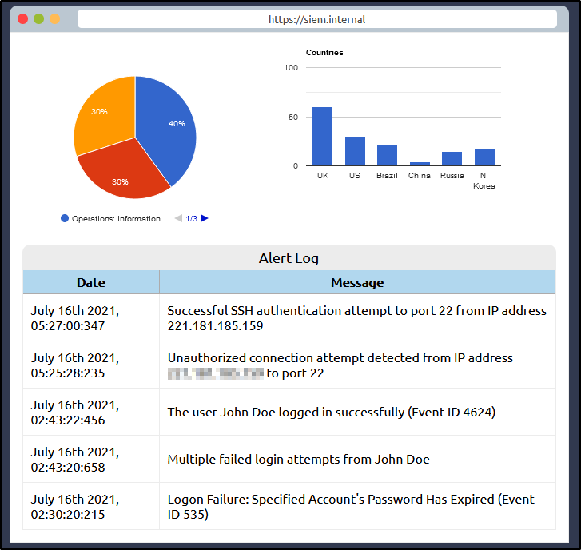
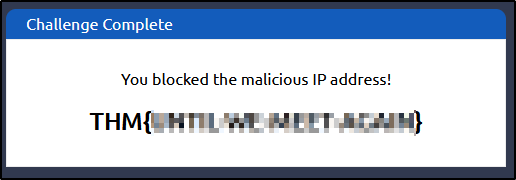

# Jr Security Analyst Intro

This is my walkthrough of the Jr Security Analyst Intro room from [TryHackme](https://tryhackme.com/room/jrsecanalystintrouxo).

## A career as a Junior (Associate) Security Analyst

In the Junior Security Analyst role, you will be a Triage Specialist. You will spend a lot of time triaging or monitoring the event logs and alerts.

The responsibilities for a Junior Security Analyst or Tier 1 SOC Analyst include:
* Monitor and investigate the alerts (most of the time, it's a 24x7 SOC operations environment)
* Configure and manage the security tools
* Develop and implement basic [IDS (Intrusion Detection System)](https://www.barracuda.com/glossary/intrusion-detection-system) signatures
* Participate in SOC working groups, meetings
* Create tickets and escalate the security incidents to the Tier 2 and Team Lead if needed

Required qualifications (most common):
* 0-2 years of experience with Security Operations
* Basic understanding of Networking ( OSI model (Open Systems Interconnection Model) or  TCP/IP model (Transmission Control Protocol/Internet Protocol Model)), Operating Systems (Windows, Linux), Web applications. To further learn about OSI and TCP/IP models, please refer to the [Introductory Networking Room](https://tryhackme.com/room/introtonetworking).
* Scripting/programming skills are a plus

Desired certification:
* [CompTIA Security+](https://www.comptia.org/certifications/security) 

As you progress and advance your skills as a Junior Security Analyst, you will eventually move up to Tier 2 and Tier 3.

An overview of the Security Operations Center (SOC) Three-Tier Model:

## Security Operations Center (SOC)

### So, what exactly is a SOC?

The core function of a SOC (Security Operations Center) is to investigate, monitor, prevent, and respond to threats in the cyber realm 24/7 or around the clock. Per [McAfee's definition of a SOC](https://www.mcafee.com/enterprise/en-us/security-awareness/operations/what-is-soc.html),  "Security operations teams are charged with monitoring and protecting many assets, such as intellectual property, personnel data, business systems, and brand integrity. As the implementation component of an organization's overall cybersecurity framework, security operations teams act as the central point of collaboration in coordinated efforts to monitor, assess, and defend against cyberattacks". The number of people working in the SOC can vary depending on the size of the organization. 

### Preparation and Prevention

As a Junior Security Analyst, you should stay informed of the current cybersecurity threats (Twitter and [Feedly](https://feedly.com/i/welcome) can be great resources to keep up with the news related to Cybersecurity). It's crucial to detect and hunt threats, work on a [security roadmap](https://www.mcafee.com/enterprise/en-us/security-awareness/cybersecurity/creating-cybersecurity-strategy.html) to protect the organization, and be ready for the worst-case scenario

Prevention methods include gathering intelligence data on the latest threats, threat actors, and their [TTPs (Tactics, Techniques, and Procedures)](https://www.optiv.com/explore-optiv-insights/blog/tactics-techniques-and-procedures-ttps-within-cyber-threat-intelligence). It also includes the maintenance procedures like updating the firewall signatures, patching the vulnerabilities in the existing systems, block-listing and safe-listing applications, email addresses, and IPs. 

To better understand the TTPs, you should look into one of the CISA's (Cybersecurity & Infrastructure Security Agency) alerts on APT40 (Chinese Advanced Persistent Threat). Refer to the following link for more information, https://us-cert.cisa.gov/ncas/alerts/aa21-200a. 

### Monitor and Investigation

A SOC team proactively uses [SIEM (Security information and event management)](https://www.fireeye.com/products/helix/what-is-siem-and-how-does-it-work.html) and [EDR (Endpoint Detection and Response)](https://www.mcafee.com/enterprise/en-us/security-awareness/endpoint/what-is-endpoint-detection-and-response.html) tools to monitor suspicious and malicious network activities. Imagine being a firefighter and having a multi-alarm fire - one-alarm fires, two-alarm fires, three-alarm fires; the categories classify the seriousness of the fire, which is a threat in our case. As a Security Analyst, you will learn how to prioritize the alerts based on their level: Low, Medium, High, and Critical. Of course, it is an easy guess that you will need to start from the highest level (Critical) and working towards the bottom - Low-level alert. Having properly configured security monitoring tools in place will give you the best chance to mitigate the threat. 

Junior Security Analysts play a crucial role in the investigation procedure. They perform triaging on the ongoing alerts by exploring and understanding how a certain attack works and preventing bad things from happening if they can. During the investigation, it's important to raise the question "How? When and why?". Security Analysts find the answers by drilling down on the data logs and alerts in combination with using the open-source tools, which we will have a chance to explore later in this path. 

### Response

After the investigation, the SOC team coordinates and takes actions on the compromised hosts, which involves isolating the hosts from the network, terminating the malicious processes, deleting files, and more.
## A day In the life of a Junior (Associate) Security Analyst

To understand the job responsibilities for a Junior (Associate) Security Analyst, let us first show you what a day in the life of the Junior Security Analyst looks like and why this is an exciting career journey.

To be in the frontline is not always easy and can be very challenging as you will be working with various log sources from different tools that we will walk you through in this path. You will get a chance to monitor the network traffic, including IPS (Intrusion Prevention System) and IDS (Intrusion Detection System) alerts, suspicious emails, extract the forensics data to analyze and detect the potential attacks, use open-source intelligence to help you make the appropriate decisions on the alerts.

One of the most exciting and rewarding things is when you are finished working on an incident and have managed to remediate the threat. Incident Response might take hours, days, or weeks; it all depends on the scale of the attack: did the attacker manage to exfiltrate the data? How much data does the attacker manage to exfiltrate? Did the attacker attempt to pivot into other hosts? There are many questions to ask and a lot of detection, containment, and remediation to do. We will walk you through some fundamental knowledge that every Junior (Associate) Security Analyst needs to know to become a successful Network Defender. 

The first thing almost every Junior (Associate) Security Analyst does on their shift is to look at the tickets to see if any alerts got generated.

Are you ready to immerse yourself into the role of a Junior Security Analyst for a little bit? 

### What was the malicious IP address in the alerst?

### To whom did you escalate the event associated with the malicious IP address?

SOC Team Lead

### After blocking the malicious IP Address on the firewall, what message did the malicious actor leave for you?

